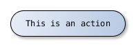
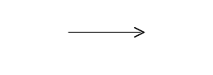
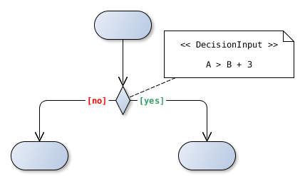
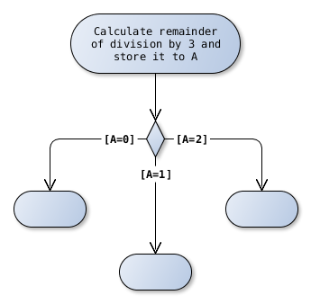
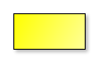
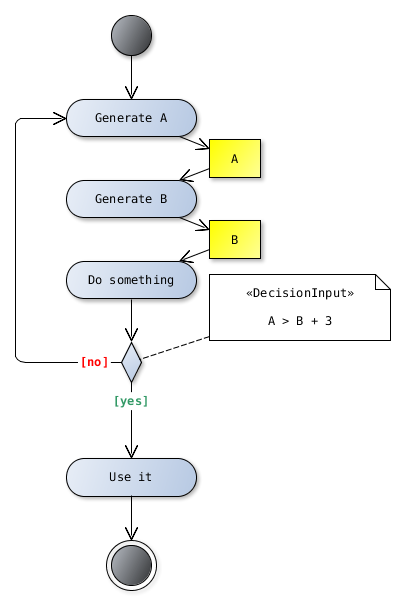

Activity Diagram
================

Actions
-------

.. admonition:: 15.2.4 Notation
  :class: tip

  The notations for ActivityNodes are illustrated below. This notation is
  discussed in more detail in the following sub clauses (and in Clause 16 for
  Actions).

.. admonition:: 16.2.4.1 Actions
  :class: tip

  Actions are notated as round-cornered rectangles, as shown in Figure 16.2.
  The name of the action or other description of it may appear in the symbol.

Activity Edge
-------------

.. admonition:: 15.2.4 Notation
  :class: tip

  An ActivityEdge (whether a ControlFlow or ObjectFlow) is notated by an open
  arrowhead line connecting two ActivityNodes. If the edge has a name, it is
  notated near the arrow. Guards are shown as text in square brackets near
  tail of the line.

.. image:: activity-diagram/activity-edge-yes.png
  :align: center

Decision Nodes
--------------

.. admonition:: 15.3.4.3 Merge Nodes and Decision Nodes
  :class: tip

  The notation for both MergeNodes and DecisionNodes is a diamond-shaped
  symbol

.. admonition:: 15.3.4.3 Merge Nodes and Decision Nodes
  :class: tip

  A decisionInput on a DecisionNode is notated in a note symbol attached to
  the DecisionNode symbol, with the keyword «decisionInput», as shown in
  Figure 15.33

.. image:: activity-diagram/decision-two.png
  :align: center

Initial Node
------------

.. admonition:: 15.3.4.1 Initial and Final Nodes
  :class: tip

  InitialNodes are notated as a solid circle

Final Nodes
-----------

.. admonition:: 15.3.4.1 Initial and Final Nodes
  :class: tip

  ActivityFinalNodes are notated as a solid circle within a hollow circle, as
  shown in Figure 15.28. This can be thought of as a goal notated as
  “bull’s eye,” or target.

.. note::

  It's not possible to create this as one element so it's separated to
  "Final Node (internal)" and "Final Node (external).

Object Nodes
------------

.. admonition:: 15.4.4.1 Object Nodes
  :class: tip

  ObjectNodes are notated as rectangles

Example
-------

Links
-----

.. seealso::

  `UML Activity Diagrams: Reference <https://msdn.microsoft.com/en-us/library/dd409360.aspx>`_
