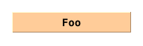
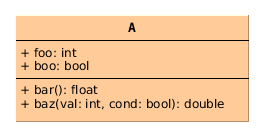
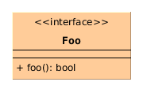
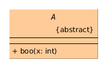
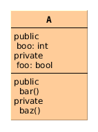
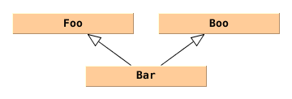
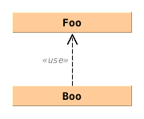
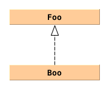
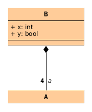
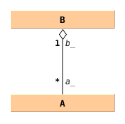

Class Diagram
=============

Class
-----

.. admonition:: 9.2.4.1 Classifiers
  :class: tip

  The default notation for a Classifier is a solid-outline rectangle containing
  the Classifier’s name, and with compartments separated by horizontal lines
  below the name. The name of the Classifier should be centered in boldface.
  For those languages that distinguish between uppercase and lowercase
  characters, Classifier names should begin with an uppercase character.

.. code-block:: cpp

  class Foo { /* ... */ };

.. code-block:: cpp

  class A {
   public:
    int foo;
    bool boo;

    float bar();
    double baz(int val, bool cond);
  };

.. admonition:: 10.4.4 Notation
  :class: tip

  An Interface may be designated using the default notation for Classifier (see
  9.2.4) with the keyword «interface».

.. admonition:: 9.2.4.1 Classifiers
  :class: tip

  If the default notation is used for a Classifier, a keyword corresponding to
  the metaclass of the Classifier shall be shown in guillemets above the name.

.. code-block:: cpp

  class Foo {
   public:
    virtual bool foo();
  };

.. admonition:: 9.2.4.1 Classifiers
  :class: tip

  The name of an abstract Classifier is shown in italics, where permitted by
  the font in use. Alternatively or in addition, an abstract Classifier may be
  shown using the textual annotation {abstract} after or below its name .

.. code-block:: cpp

  class A {
   public:
    virtual void boo(int x) =0;
  };

.. admonition:: 9.2.4.1 Classifiers
  :class: tip

  Any compartment which contains notation for Features may show those Features
  grouped under the literals public, private and protected, representing their
  visibility . The visibility literals are left-justified in the compartment
  with the Features’ notation appearing indented beneath them. The groups may
  appear in any order. Visibility grouping is optional: a conforming tool need
  not support it.

.. code-block:: cpp

  class A {
   public:
    int boo;

   private:
    bool foo;

   public:
    void bar();

   private:
    void baz();
  };

Generalization
--------------

.. admonition:: 9.2.4.2 Other elements
  :class: tip

  A Generalization is shown as a line with a hollow triangle as an arrowhead
  between the symbols representing the involved Classifiers. The arrowhead
  points to the symbol representing the general Classifier.

.. code-block:: cpp

  class Foo { /* ... */ };
  class Boo { /* ... */ };

  class Bar: public Foo, public Boo { /* ... */ };

Usage
-----

.. admonition:: 7.7.4 Notation
  :class: tip

  A Dependency is shown as a dashed arrow between two model Elements. The model
  Element at the tail of the arrow (the client) depends on the model Element
  at the arrowhead (the supplier). The arrow may be labeled with an optional
  keyword or stereotype and an optional name (see Figure 7.18).

.. admonition:: 7.7.4 Notation
  :class: tip

  A Usage is shown as a Dependency with a «use» keyword attached to it.

.. code-block:: cpp

  class Foo {
   public:
    void foo();
  };

  class Boo {
   public:
    void boo(Foo& x) {
      return x.foo();
    }
  };

Realization
-----------

.. admonition:: 7.7.4 Notation
  :class: tip

  A Realization is shown as a dashed line with a triangular arrowhead at the
  end that corresponds to the realized Element.

.. code-block:: cpp

  class Foo {
   public:
    virtual void foo() =0;
  };

  class Boo: public Foo {
   public:
    virtual void foo() { /* ... */ }
  };

Composition
-----------

.. admonition:: 11.5.4 Notation
  :class: tip

  Any Association may be drawn as a diamond (larger than a terminator on a
  line) with a solid line for each Association memberEnd connecting the diamond
  to the Classifier that is the end’s type.

.. admonition:: 11.5.4 Notation
  :class: tip

  An Association end is the connection between the line depicting an
  Association and the icon (often a box) depicting the connected Classifier. A
  name string may be placed near the end of the line to show the name of the
  Association end.

.. admonition:: 11.5.4 Notation
  :class: tip

  A binary Association may have one end with aggregation =
  AggregationKind::shared or aggregation = AggregationKind::composite. When one
  end has aggregation = AggregationKind::shared a hollow diamond is added as a
  terminal adornment at the end of the Association line opposite the end marked
  with aggregation = AggregationKind::shared. The diamond shall be noticeably
  smaller than the diamond notation for Associations. An Association with
  aggregation = AggregationKind::composite likewise has a diamond at the
  corresponding end, but differs in having the diamond filled in.

.. admonition:: 9.5.3 Semantics
  :class: tip

  Indicates that the Property is aggregated compositely, i.e., the composite
  object has responsibility for the existence and storage of the composed
  objects

.. admonition:: 9.5.3 Semantics
  :class: tip

  Composite aggregation is a strong form of aggregation that requires a part
  object be included in at most one composite object at a time. If a composite
  object is deleted, all of its part instances that are objects are deleted
  with it.

.. admonition:: 11.5.3.1 Associations
  :class: tip

  The multiplicities at the other ends of the association determine the number
  of instances in each partition. So, for example, 0..1 means there is at most
  one instance per qualifier value.

.. admonition:: 11.5.4 Notation
  :class: tip

  An Association end is the connection between the line depicting an
  Association and the icon (often a box) depicting the connected Classifier. A
  name string may be placed near the end of the line to show the name of the
  Association end.  The name is optional and suppressible.

.. code-block:: cpp

  class A { /* ... */ };

  class B {
   public:
    int x;
    bool y;

    A a[4];
  };

.. seealso::

  `UML Association Reference <http://www.uml-diagrams.org/association-reference.html>`_

Aggregation
-----------

.. code-block:: cpp

  class B;

  class A {
   public:
    A(B& b): b_(b) {}

   private:
    B& b_;
  };

  class B {
   public:
    void add(A& a) {
      a_.push_back(&a);
    }

   private:
    std::vector<A*> a_;
  };

