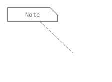

Comment (note symbol)
---------------------

``[7.2.4 Notation]``::

    A Comment is shown as a rectangle with the upper right corner bent (this is
    also known as a “note symbol”). The rectangle contains the body of the
    Comment. The connection to each annotatedElement is shown by a separate
    dashed line. The dashed line connecting the note symbol to the
    annotatedElement(s) may be suppressed if it is clear from the context,
    or not important in this diagram.

