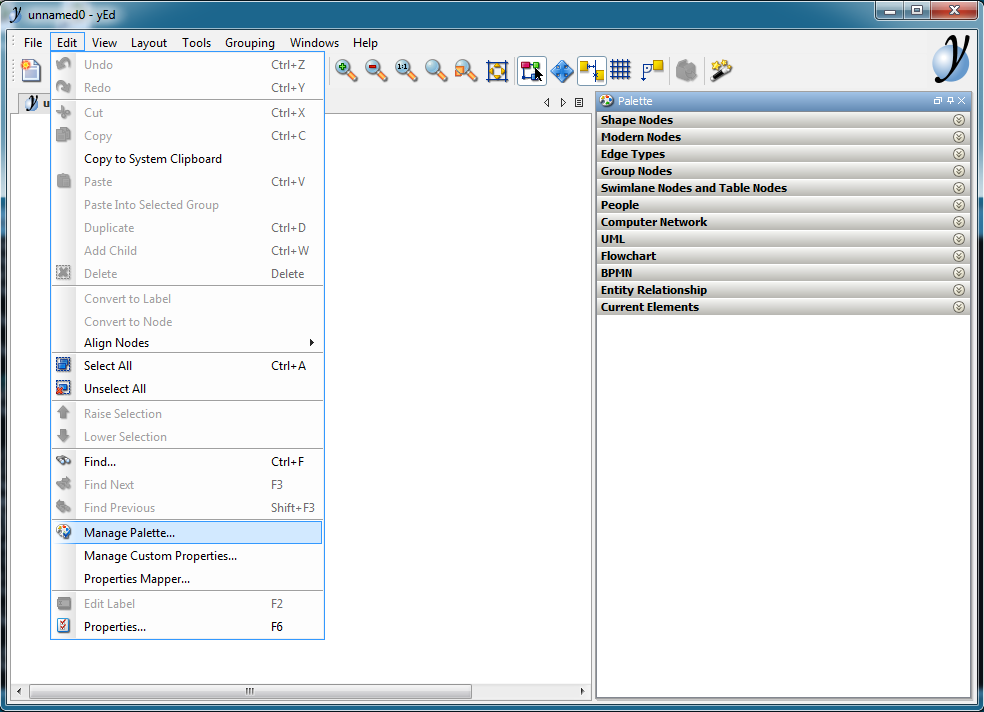
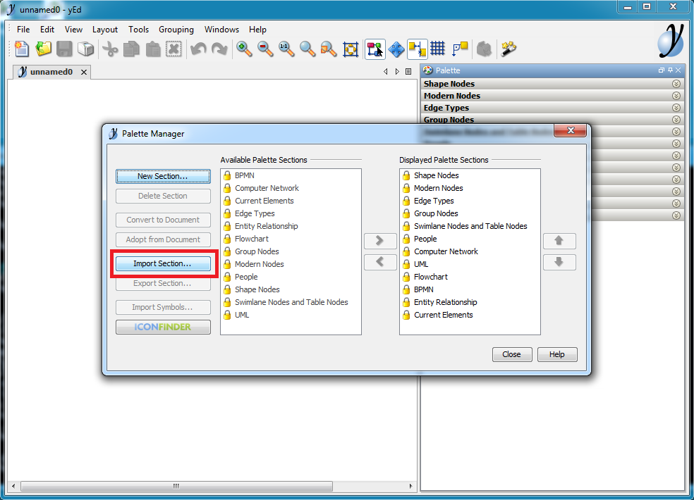
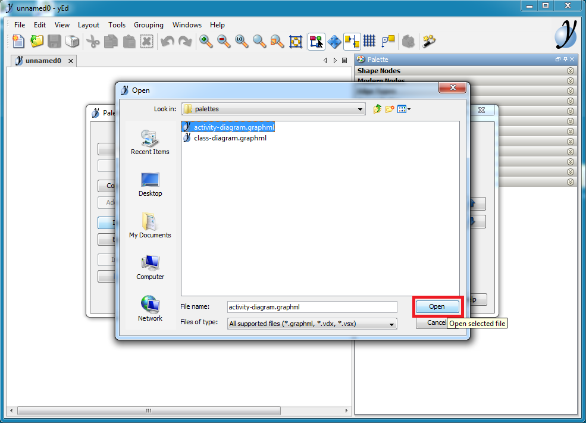
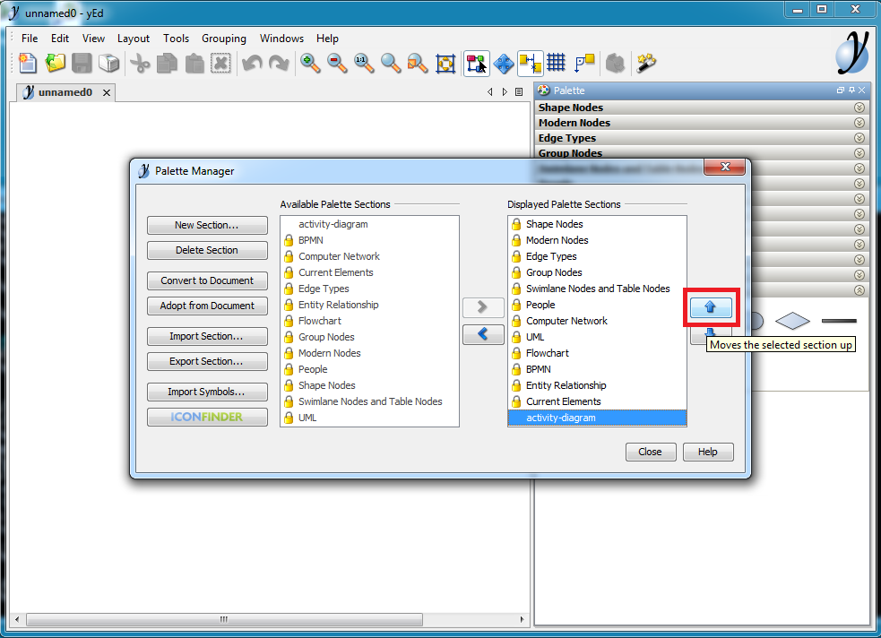
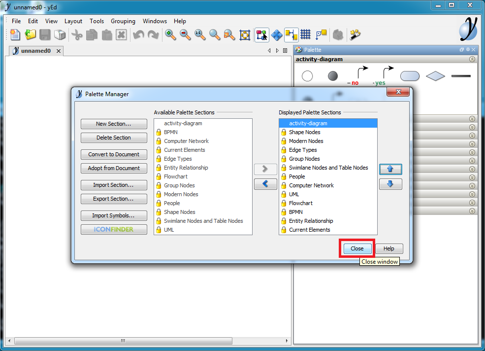
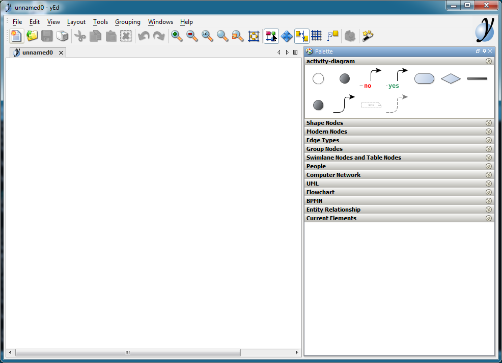

Loading yEd palettes
====================

Download
--------

To load palettes download/clone this repo with ``palettes`` directory:

.. code-block:: bash

    > git clone https://github.com/ruslo/yed-uml
    > cd yed-uml
    [yed-uml]> ls -d palettes
    palettes/

Loading into yEd
----------------

Follow these steps for each palette to load them all into ``yEd``.

Go to ``Edit`` -> ``Manage Palette...``:

Click ``Import Section``:

Find ``palette`` directory and load file:

Move palette up so it will be easier to access it:

After palette reach the top click ``Close``:

New palette is loaded and can be used:

