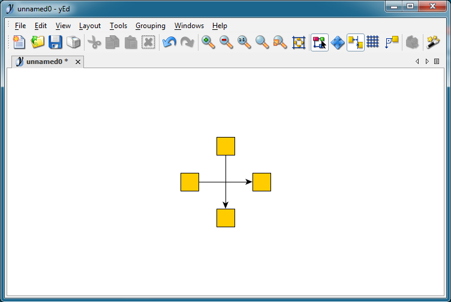
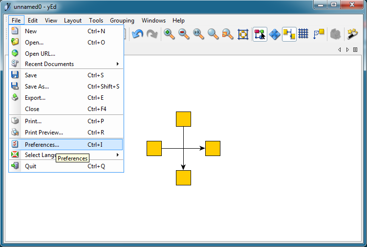
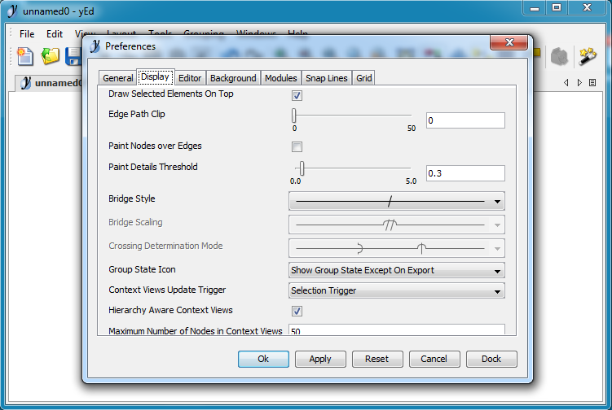
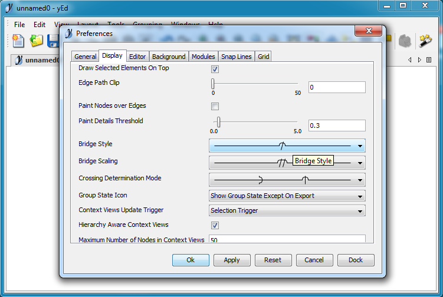
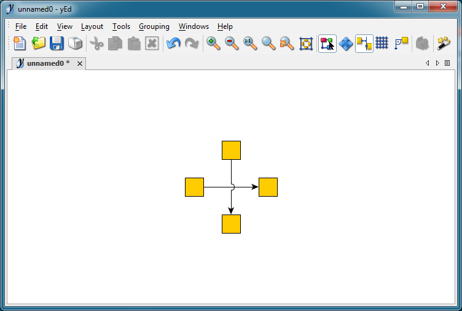

Setup
=====

Installation
------------

yEd can be downloaded and installed from official site:

* `Downloads <http://www.yworks.com/downloads#yEd>`_

Line intersection
-----------------

By default line intersection is not marked:

To change it go to ``File`` -> ``Preferences``:

Choose ``Display``:

Change ``Bridge Style``:

Result:

